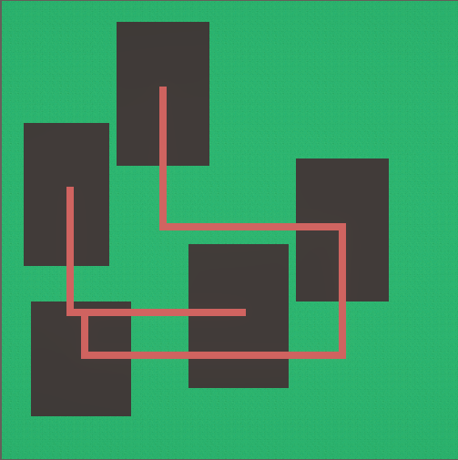
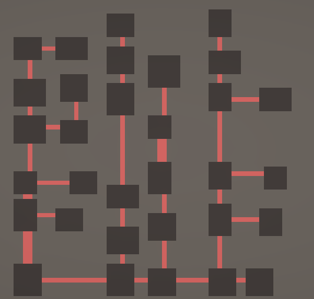
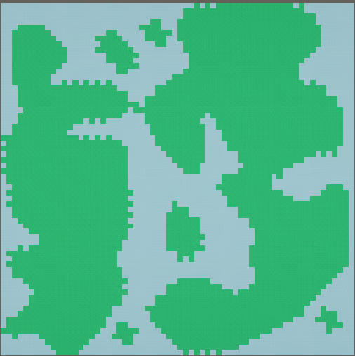
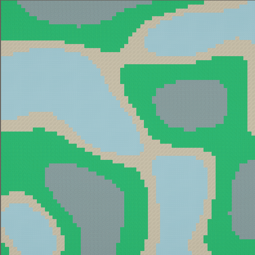

Procedural Generation

Dans ce projet, on peut utiliser 4 méthodes différentes de générétion procédurale avec chacune des utilités différentes.
Toutes les méthodes sont des SO (scriptable object) et utilisent une seed pour gérer leur aléatoire.
Exemple de création d'un SO qui fonctionne avec le ProceduralGridGenerator.cs (pour l'utiliser il faut juste glisser un SO créé dans le script ProceduralGridGenerator qui est sur un gameobject dans la scene

```csharp
 [CreateAssetMenu(menuName = "Procedural Generation Method/Simple Room Placement")]
    public class SimpleRoomPlacement : ProceduralGenerationMethod
    {
        [Header("Room Parameters")]
        [SerializeField] private int _maxRooms = 10;
        
        protected override async UniTask ApplyGeneration(CancellationToken cancellationToken)
        {
            // Declare variables here
            // ........

            for (int i = 0; i < _maxSteps; i++)
            {
                // Check for cancellation
                cancellationToken.ThrowIfCancellationRequested();
                
                // Your algorithm here
                // .......

                // Waiting between steps to see the result.
                await UniTask.Delay(GridGenerator.StepDelay, cancellationToken : cancellationToken);
            }
            
            // Final ground building.
            BuildGround();
        }
}
```

===
## 1. Simple Room Placement
La version simplifié du BSP, elle est utile pour la création de carte avec des salles

<center>
    
</center>

## 2.BSP

<center>
    
</center>

## 3.Cellular Automata

<center>
    
</center>

## 4.FastNoiseLite

<center>
    
</center>
